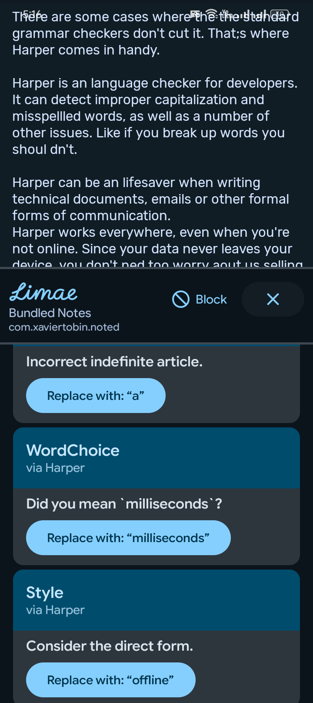
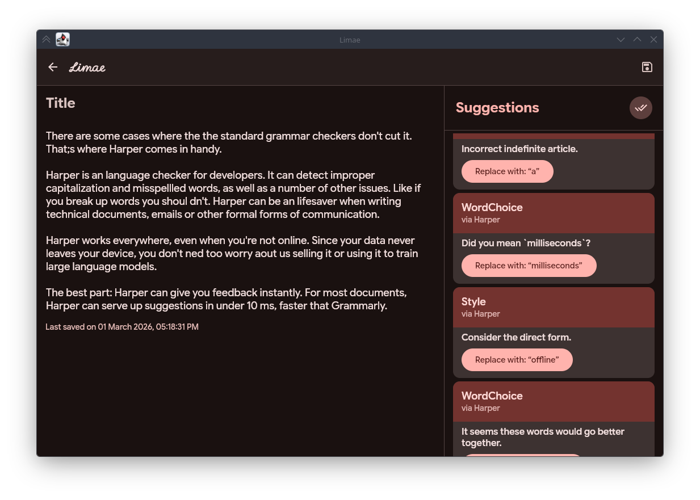
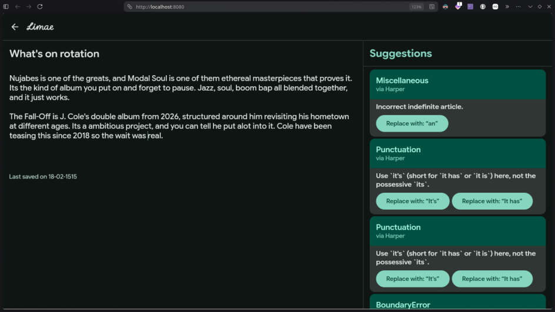

# Limae

Limae corrects and polishes your writing locally. Everything runs on-device or on a self-hosted
server you control. Nothing reaches servers you don't control.

Secretary Bird, the mascot of Limae, is an artwork done
by [Maxime Budar](https://maximebudar.artstation.com/). Check out
his [ArtStation](https://www.artstation.com/maximebudar) for more dope work.

Built with Kotlin and Compose Multiplatform, it runs across Android, Desktop, and Web, wrapping
multiple open-source linguistic tools under one interface.

|            Android             |            Desktop             |          Web           |
|:------------------------------:|:------------------------------:|:----------------------:|
|  |  |  |

The core engines strictly edit and correct. They don't hallucinate, rewrite your meaning, or
generate content. They're just not capable of that.

Harper runs as the default across all platforms, with LanguageTool additionally available on
desktop. On Android, Limae runs as a system-wide overlay via accessibility service, like the
Grammarly app, except your data stays on your device.

A [co-edit](https://huggingface.co/collections/grammarly/coedit) feature may come with the
self-hostable server down the line, but that's optional and not the focus.

### Development & Licensing

Still in active development. No ETA on the first release.

`base` is the main branch. Once the first release is out, things will happen on the `dev` branch,
later merged to the `base` branch.

All client applications within the `@LimaeApp` organization will be licensed under GPLv3.

Limae will not include any Todo or typical note-taking app features. Opening issues or pull requests
regarding these is a waste of time and will not be merged or acknowledged.

*Note: This repository might be transferred to the `@LimaeApp` organization in the future since
other components might be added to this project, especially a dedicated language server.*

While you are here, do yourself a favor and listen to *Modal Soul* by Nujabes.